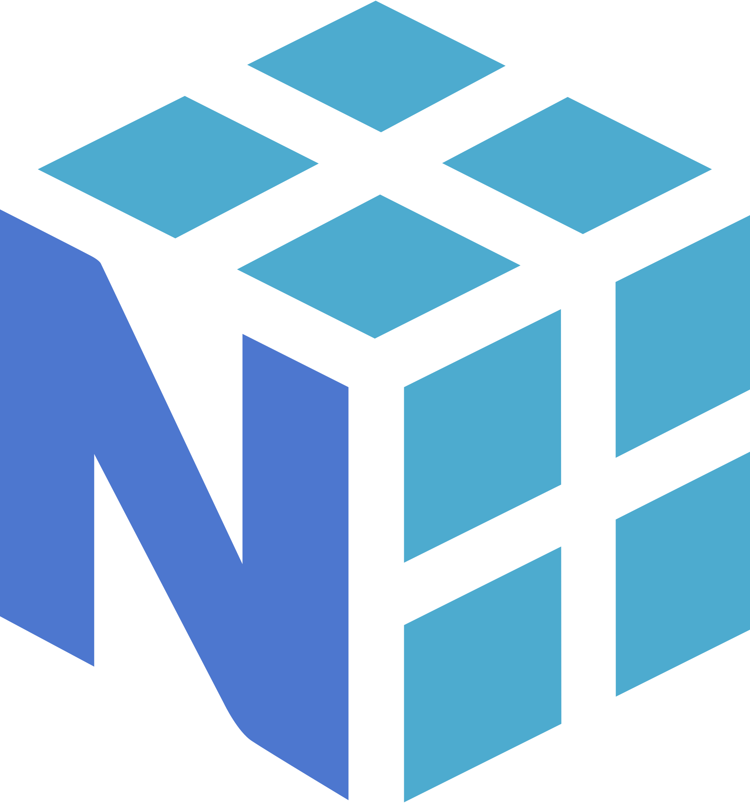

<h1 align="center">Hi Guys  Myself Srajan Chourasia</h1>


<!-- <br> -->

<p align="right"> </p>

<!-- [)](https://git.io/typing-svg) -->


<p align = center>
<a href="https://git.io/typing-svg"></a>
</p>


<!-- <p>

</p> -->

```
I’m currently learning 💦 GAN, and how to Combine ✨ Models with 🕹️ Hardware to Perform Various 💻 Task!

I have a strong interested in 🍀 Deep Learning, 🍂 A.I/ML, 🔖 RL and their applications in different fields like 🌌 IoT, 🎍 Web development, and 🤖 Robotics.

I’m looking to collaborate on 🐬 Deep Learning, 🎴 AI/ML/RL and 🌀 python libraries or projects.

Ask me about 🧊 Deep Learning, 🔮 AI/ML, 🍣 Reinforcement Learning and there application in various domains.

Fun fact I love Watching Anime 🎐 and Reading Manga ⛩️
```

<!-- <h2 align="center"><I>A passionate AI developer from India.</I></h2> -->

<!-- ## 📠Student at [IIT Goa ](https://iitgoa.ac.in/)<a href="https://emoji.gg/emoji/1251-inferna-satisfied"></a> -->


<!-- <p align="left"> <a href="https://github.com/ryo-ma/github-profile-trophy"></a> 
</p> -->

<!-- <br> -->

<h2 align="left">🌐 Connect with me:</h2>
<p align="left">
<a href="https://www.linkedin.com/in/srajan-chourasia/" target="blank"></a>
<a href="https://kaggle.com/srajanchourasia" target="blank"></a>
<a href="https://www.leetcode.com/srajan_kiyotaka" target="blank"></a>
<a href="https://www.codechef.com/users/tatsuya" target="blank"></a>
<a href="https://codeforces.com/profile/yukihira" target="blank"></a>
<a href="https://www.hackerrank.com/srajan_chourasia" target="blank"></a>
<a href="https://stackoverflow.com/users/20237834" target="blank"></a>
<!-- <a href="https://hashnode.com/@srajankiyotaka" target="blank"></a> -->
<!-- <a href="https://medium.com/@srajanstark.ash" target="blank"></a>   -->
<!-- <a href="https://dev.to/srajankiyotaka" target="blank"></a> -->
<a href="https://www.youtube.com/@srajanchourasia" target="blank"></a>
<a href="https://twitter.com/@srajankiyotaka" target="blank"></a>
<a href="https://instagram.com/srajan.ash" target="blank"></a>   
</p>


<h2 align="left">💻 Languages and Tools:</h2>


<!-- New style display -->

| Categorya | Tools |
|-----------|-------|
| Languages | <a href="https://www.cprogramming.com/" target="_blank" rel="noreferrer">  </a>  <a href="https://www.w3schools.com/cpp/" target="_blank" rel=“noreferrerâ€> </a> <a href="https://www.python.org" target="_blank" rel="noreferrer">  </a> <a href="https://developer.mozilla.org/en-US/docs/Web/JavaScript" title= "javascript" et="_blank">  </a> <a href="https://www.haskell.org/" target="_blank" rel="noreferrer">  </a> |
| AI/ML/DL/RL | <a href="https://www.tensorflow.org" target="_blank" rel="noreferrer">  </a> <a href="https://pytorch.org/" target="_blank" rel=“noreferrerâ€>  </a> <a href="https://keras.io/" target="_blank" rel=“noreferrerâ€>  </a> |
| Libraries | <a href="https://opencv.org/" target="_blank" rel="noreferrer">  </a> <a href="https://pandas.pydata.org/" target="_blank" rel="noreferrer">  </a> <a href="https://seaborn.pydata.org/" target="_blank" rel="noreferrer">  </a> <a href="https://scikit-learn.org/" target="_blank" rel="noreferrer">  </a> <a href="https://matplotlib.org/" target="_blank" rel="noreferrer">  </a> <a href="https://numpy.org/" target="_blank" rel="noreferrer">  </a> |
| Web Development | <a href="https://www.w3.org/html/" target="_blank" rel="noreferrer">  </a> <a href="https://www.w3schools.com/css/" target="_blank" rel="noreferrer">  </a> <a href="https://www.mysql.com/" target="_blank" rel="noreferrer">  </a>  |
| Software and Tools | <a href="" target="_blank" rel="noreferrer">  </a> <a href="https://www.mathworks.com/" target="_blank" rel="noreferrer">  </a>  <a href="" target="_blank" rel="noreferrer">  </a> <a href="" target="_blank" rel="noreferrer">  </a> <a href="" target="_blank" rel="noreferrer">  </a> |
| OS | <a href="https://www.linux.org/" target="_blank" rel="noreferrer">  </a> <a href="" target="_blank" rel="noreferrer">  </a> <a href="" target="_blank" rel="noreferrer">  </a> <a href="" target="_blank" rel="noreferrer">  </a>  |

<!--  <a href="" target="_blank" rel="noreferrer">  </a> -->


<details>
<summary> 
📦 Python Packages:
</summary>

<br>

<!-- <a href="https://github.com/srajan-kiyotaka/bayes_Net_Sample">
    
</a> -->

[](https://github.com/srajan-kiyotaka/TraverseCraft)  [](https://github.com/srajan-kiyotaka/bayes_Net_Sample)

</details>

<!-- <br> -->

<details>
<summary> 
📊 My GitHub Stats!
</summary>

<br>

<p align="left"> <a href="https://github.com/ryo-ma/github-profile-trophy"></a> 
</p>

<p></p>

<p>&nbsp;</p>

<p></p>

</details>

<!-- 
<p>

</p>

<p>&nbsp;

</p>

[](https://git.io/streak-stats)

<br>
<a href="https://twitter.com/Srajankiyotaka"></a> -->
<!-- [](https://twitter.com/Srajankiyotaka) -->

## 💰 You can help me by [Sponsoring](https://github.com/sponsors/srajan-kiyotaka/) and supporting my Open-Source Work ❤️

<p align="center"> With ❤️ from India 🇮🇳 </p>
